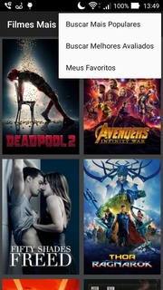

# FilmesFamosos
O aplicativo proporciona ao seu usuário acesso a API disponível no www.themoviedb.org. O consumo desse serviço, dá ao usuário final, acesso aos filmes mais populares e com melhor avaliação entre seus usuários. 

### Informação importante de configuração para uso da API

Para o funcionamento do aplicativo, é necessário informar uma **api_key** do serviço **themoviedb**. O aplicativo esta configurado para obter esse valor no arquivo **string.xml** no diretório **res**. 
  
**Localize a tag cfg_app_api_key_value, para informação da api_key:**
 
**Em seguida substitua o valor INSERIR SUA CHAVE DE API AQUI, que é o valor da tag pela api_key**
 
 

### Funcionamento do Aplicativo

Ao iniciar o Aplicativo, a primeira Activity disponibiliza por padrão, a lista de Filmes mais populares do serviço The Movie DB. Está disponível para o usuário um menu composto de 3 itens. Esses itens são respectivamente, **Buscar Mais Populares**, **Buscar Melhores Avaliados** e **Meus Favoritos**. 

### Sobre a primeira Activity

A primeira Activity, é a principal do Aplicativo. Sua configuração está como GridLayout de 2 colunas e os filmes são exibidos em cartazes. **Verifique a imagem anterior**.

### Sobre o item de menu - Buscar Mais Populares

Esse comando obtém os Filmes Mais Populares e exibe apenas o seu cartaz. 

### Sobre o item de menu - Buscar Melhores Avaliados

Esse comando obtém os Filmes Melhores Avaliados pelos usuários do aplicativo. Sua exibição na tela, obedece o mesmo requisito da tela de Mais Populares

### Sobre o item de menu - Meus Favoritos

Esse comando permite que você marque seu filme favorito e o inclua na Base de Dados de seu dispositivo. As duas funcionalidades de listagem dos filmes, 
necessita que o dispositivo esteja conectado a Internet para realização da tarefa. A inclusão de um filme no Favorito, permite a visualização off line do Poster do Filme, Imagem de Apresentação, Título, Data de Lançamento e Ranking. 

### O Cartaz do filme é um comando

Recebe evento de clique que carrega uma segunda Activity, contendo os detalhes do filme selecionado. 

### Activity de Detalhes

Os seguintes itens são exibidos na tela de Detalhes 

* Titulo
* Sinopse
* Pontuação de Ranking
* Data de Lançamento
* Trailer
* Resenha dos usuários   

## Adicionando um Filme ao Favoritos

Ao clicar no Item de Menu representado com um ícone de coração, o aplicativo disponibiliza esse filme a sessão de favoritos.  

   

## Activity de Favoritos

Para visualizar os dados do filme incluído no favoritos, não é necessário estar conectado na internet. No entanto sua visualização será limitada.
Trailer e Resenhas de Usuários não estão disponíveis.   
   

## Compartilhando 

É possivel compartilhar um filme exibido no detalhe, no entanto é necessário que exista ao menos um trailer em exibição.  
   

## Visualização em Vídeo do App

  